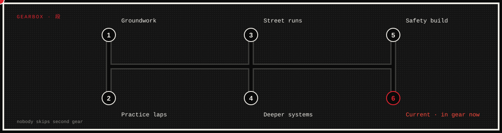

<!--
  You opened the raw file. Good instinct.
  Rule zero of this garage: nothing here claims more than the commit history can prove.
  The pit radio on the website keeps a note that `ls` does not show. Try `ls -a`.
  Every car drawn here is an original design, not a real make or model.
-->

<div align="center">



<sub>

[`DRIVER`](#driver) &nbsp;·&nbsp;
[`TUNE SHEET`](#tune-sheet) &nbsp;·&nbsp;
[`RUN LOG`](#run-log) &nbsp;·&nbsp;
[`GEARBOX`](#gearbox) &nbsp;·&nbsp;
[`ROLL CAGE`](#roll-cage) &nbsp;·&nbsp;
[`TELEMETRY`](#telemetry) &nbsp;·&nbsp;
[`PIT WALL`](#pit-wall)

</sub>

</div>

<br />

## Driver

```console
$ whoami
Mochammad Bisma Prasetya
IT Developer at Spindo · 3-5 years of writing code · S1 Informatika

$ run --current
RUN-01   MTOA Access Link Register                 ON TRACK
         access links in one place; private means private, even for the admin
         features: 9 implemented · 4 in progress · 1 planned

$ parts --inspect flask
Flask  [####]  race-tuned
built    MTOA ALR, split into routes / services / models / schemas / security / utils
learned  routes stay thin; rules live in services, where tests can reach them
```

I build the internal tools other teams use at Spindo: an asset inventory, a reporting dashboard, and now an access link register that has to keep secrets from its own administrators.

I learn by building the thing. Flask and PostgreSQL started as practice laps: a CRUD app from an empty folder. The same stack now runs ALR, with migrations, tests, and an audit log nobody can edit. Before that: Laravel sites, Flutter apps, and a thesis about stock-keeping for small grocery stores.

> *Nothing in this garage claims more than the commit history can prove.*

<a href="https://masbismaa.github.io/Masbismaa/"></a>

<br />

## Tune sheet

Every part is rated by evidence, not by feel. **Race-tuned**: in daily use on an active project. **Street-tuned**: used to build at least one real project. **Stock**: learned and practised, no run on record yet. **On the dyno**: studying now.

| Tune | Parts |
|:--|:--|
| `■■■■` **Race-tuned** | Python · Flask · PostgreSQL · SQLAlchemy · Alembic · Pytest · Git |
| `■■■□` **Street-tuned** | Django · Laravel · PHP · MySQL · Firestore · Flutter · Dart · HTML/CSS/JS · OWASP ZAP · PowerShell |
| `■■□□` **Stock** | CodeIgniter · MongoDB · Tailwind CSS · GitLab CI · C++ · C# |
| `■□□□` **On the dyno** | Docker and cloud · Penetration testing · API design and microservices · LLM integration |

<details>
<summary><b>OPEN THE PART SHEETS</b> &nbsp;<sub>what each one was actually used for</sub></summary>
<br />

| Part | Built with it | What it taught |
|:--|:--|:--|
| **Python** | ALR backend, the practice-laps app, Django tools at work | Written conventions keep a growing codebase readable: `snake_case` modules, `PascalCase` models, booleans starting with `is_` / `has_` / `can_` |
| **Flask** | MTOA ALR, modular backend | Routes stay thin. Validation and access rules live in services |
| **PostgreSQL** | ALR database, practice-laps app | Rules that matter go into the schema as constraints, not only into form checks |
| **SQLAlchemy** | All ALR models | Foreign keys named `entity_id` make queries read like the requirement |
| **Alembic** | ALR schema migrations | A migration is part of the change and gets reviewed like code |
| **Pytest** | ALR test suite | A negative test is where an access bug shows up first |
| **Git** | `main`, `develop`, `feature/*`; one commit per milestone; Conventional Commits | History is documentation |
| **Django** | IT asset inventory, reporting dashboard | Batteries included is fast. Knowing what the batteries do pays off later |
| **Laravel / PHP / MySQL** | Online store, information system | How much a framework decides for you |
| **Flutter / Dart** | POS cashier, catalog with ordering, field reporting, thesis app | State that has to survive a bad signal |
| **Firestore** | Thesis: real-time stock data | Modelling around documents and live sync instead of joins |
| **OWASP ZAP** | Baseline scans on apps I build | Reproduce the finding, fix the cause |
| **HTML / CSS / JS** | ALR interface on the Tabler UI kit, assets served locally | Keep markup, style and behaviour in separate files |


</details>

> *Change one thing at a time, or you will never know what fixed it.*

<br />

## Run log



<details>
<summary><b>OPEN RUN SHEET RUN-01</b> &nbsp;<sub>MTOA Access Link Register</sub></summary>
<br />

**Objective.** ICT access links, with their notes and credentials, were scattered across different places. Put them in one web app, with strict rules about who can see what.

| | |
|:--|:--|
| **System** | Flask · SQLAlchemy · Alembic · PostgreSQL · Pytest · Tabler UI (served locally) |
| **Architecture** | `routes` handle requests · `services` hold rules and validation · `models` map tables · `schemas` shape input and output · `security` holds auth, OTP and RBAC · `utils` holds shared helpers |
| **Database** | Master categories (Web, Application, Network, General), users, access entries, attachments, audit log. Tables `snake_case` plural, models `PascalCase` singular, keys `id` and `entity_id` |
| **Testing** | Every rule tested from both sides. An admin must not read a private entry; a user must not edit someone else's public entry |
| **Repository** | Private, company GitLab |

| Feature | Status |
|:--|:--|
| Login: corporate email and password, then a one-time code | `implemented` |
| Roles: Admin and User Entry | `implemented` |
| Public and Private entries (Private is hidden even from Admin) | `implemented` |
| CSRF protection and session security | `implemented` |
| URL validation (http/https), duplicate detection for URL, address and port | `implemented` |
| Upload checks: allowed file types, 10 MB per file, 5 files per entry | `implemented` |
| Rate limiting on login and OTP | `implemented` |
| Immutable audit log: who, when, what, IP, old and new values | `implemented` |
| Schema migrations and database constraints | `implemented` |
| Dynamic form per category, extra fields for General | `in progress` |
| Search, category filter, export to Excel | `in progress` |
| Workspaces with member invites | `in progress` |
| Link status check | `in progress` |
| OTP delivery by internal email (printed to the server log during development) | `planned` |

**Lessons.** "Private" had to mean private for the admin too; that one rule shaped the whole permission model. Tagging every task with its requirement ID kept scope honest. One commit per milestone keeps the history readable for review.

</details>

<details>
<summary><b>OPEN THE REST OF THE LOG</b> &nbsp;<sub>7 more runs</sub></summary>
<br />

| Run | What it was | Parts | State |
|:--|:--|:--|:--|
| RUN-00 | **Flask and PostgreSQL practice laps.** A CRUD app built from an empty folder: routes and forms, relationships, migrations, first tests, reading tracebacks to the last line | Flask · SQLAlchemy · PostgreSQL · Pytest | finished |
| RUN-02 | **IT Asset Inventory.** Laptops and printers to software licenses | Django | finished |
| RUN-03 | **Reporting Dashboard.** Operational data as summaries and charts for management | Django | finished |
| RUN-04 | **Online Store.** Product catalog and order management | Laravel · MySQL | finished |
| RUN-05 | **Information System.** Institutional data for places like schools or clinics | Laravel · MySQL | finished |
| RUN-06 | **Mobile field kit.** POS cashier, catalog with ordering, field activity reporting | Flutter | finished |
| RUN-07 | **Thesis: grocery store inventory.** Stock records synced in real time | Flutter · Firestore | finished |

</details>

> *Private means private. Even from the admin.*

<br />

## Gearbox



| Gear | What happened there |
|:--|:--|
| **1 · Groundwork** | S1 Informatika · HTML certification (Microsoft) · PHP and Laravel with MySQL · Flutter apps, then a thesis on Flutter and Firestore · BNSP certification |
| **2 · Practice laps** | Flask CRUD from an empty folder · PostgreSQL and SQLAlchemy relationships · migrations · first tests · debugging by reading the whole traceback |
| **3 · Street runs** | Django tools for internal use · requirement IDs attached to every task |
| **4 · Deeper systems** | Two-step authentication · authorization by role and ownership · Alembic · positive and negative tests for every rule |
| **5 · Safety build** | Validation at the boundary · RBAC · CSRF and sessions · upload checks · immutable audit log · OWASP ZAP |
| **6 · Current** | MTOA ALR hardening and tests · Docker and cloud · penetration testing · API design · LLM integration |

> *Nobody skips second gear. You just stall faster.*

<br />

## Roll cage

Security is a written list of what I do when I build, with a status next to each item. Built before it is needed.

| Bar | What it covers | Where | Status |
|:--|:--|:--|:--|
| Authentication | Email and password, then a one-time code | RUN-01 | `implemented` |
| Authorization | Admin and User Entry roles, ownership, Public and Private | RUN-01 | `implemented` |
| CSRF and sessions | State-changing forms, session handling after login and OTP | RUN-01 | `implemented` |
| Input validation | URL scheme, duplicate URL, address and port | RUN-01 | `implemented` |
| Upload checks | Allowed types, size and count limits | RUN-01 | `implemented` |
| Rate limiting | Login and OTP attempts | RUN-01 | `implemented` |
| Audit logging | Immutable; who, when, what, IP, old and new values | RUN-01 | `implemented` |
| Database constraints | Integrity enforced by PostgreSQL, not only by forms | RUN-01 | `implemented` |
| Injection and XSS | Parameterised queries through the ORM, escaped output | habit | `implemented` |
| Security testing | Negative tests for access rules, ZAP baseline scans | habit | `implemented` |
| OTP by email | Real delivery instead of the development log | RUN-01 | `planned` |
| Penetration testing | Learning to attack what I build | on the dyno | `in progress` |

> *Build the cage before you need it.*

<br />

## Telemetry

Live data, regenerated daily by [a workflow in this repository](./.github/workflows/profile-images.yml). The numbers are GitHub's. The full calendar is on the [profile page](https://github.com/Masbismaa).


 

> *Commit when the lap is done, not when the day is.*

<br />

## Pit wall

| | |
|:--|:--|
| Email | `moch.bismap@gmail.com` |
| GitHub | [github.com/Masbismaa](https://github.com/Masbismaa) |
| Instagram | [@bisma.prasetya_](https://www.instagram.com/bisma.prasetya_) |
| Open to | Remote work |

<details>
<summary><sub>∴</sub></summary>
<br />

```text
pit note 0, taped inside the glovebox

rule zero   nothing here claims more than the commit history can prove
rule one    a feature is not done until its negative test fails the right way
rule two    the admin does not get to read private entries. not even me

the pit radio on the website keeps one more note. it does not show up in ls.
```

</details>
